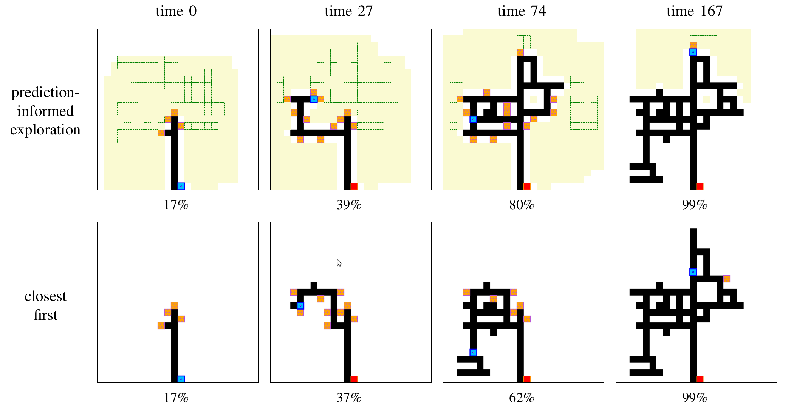

# Tunnel-Network-Exploration-with-CNN-based-World-Predictions
**Note: I am in the process of cleaning up the code, should be done by the end of sept 2020. Contact me (saroyam@oregonstate.edu) if there is any problem with the code.**


## Requirements
- Python 3.6+
- Pytorch 0.4.1+

```
pip install -r requirements.txt
```

## Usage
Use synthetic data code to generate simulation data

### Preprocess 

```
python generate_data.py
```

### Train
```
python train.py
```
<!-- 
//### Fine-tune
//```
//CUDA_VISIBLE_DEVICES=<gpu_id> python train.py --finetune --resume <checkpoint_name>
//``` -->
### Test
```
python test.py
```

## Results
Example trajectories for the Edgar Experimental Mine when using our CNN-based prefiction method and the closest first method. Robot (blue) navigates from the start (red) at bottom centre. At each timestep, the robot decides which frontier (orange) to navigate to next. 


## References
- [1]: [pytorch-inpainting-with-partial-conv](https://github.com/naoto0804/pytorch-inpainting-with-partial-conv)
